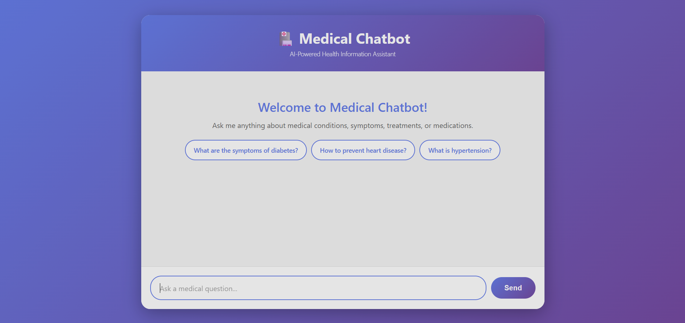
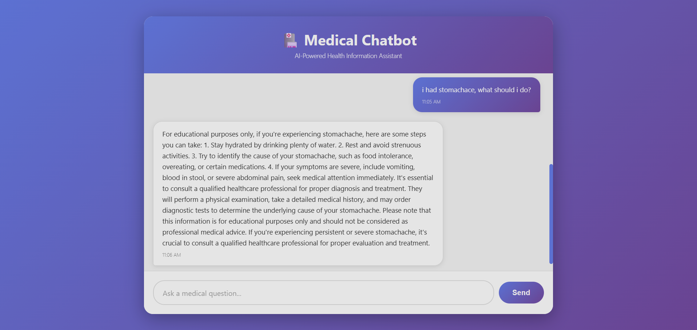

# 🏥 Medical RAG Chatbot

A **Retrieval-Augmented Generation (RAG)** based medical chatbot that answers user queries using information extracted from medical PDF documents.  
It combines semantic search with a vector database (Pinecone) and fast LLM inference (Groq / OpenAI / HuggingFace) to generate accurate, document-grounded responses.

This project demonstrates a complete end-to-end **GenAI application pipeline**: document ingestion → embeddings → vector storage → retrieval → LLM response.

---

## 📸 Screenshots

Place your screenshots inside a folder named `screenshots/`:

```

screenshots/
├── home.png
└── chat.png

````

| Home Page | Chat Interface |
|----------|---------------|
|  |  |

---

## 🚀 Project Overview

The chatbot follows a standard **RAG workflow**:

1. Medical PDFs are loaded and split into chunks  
2. Chunks are converted into embeddings  
3. Embeddings are stored in Pinecone  
4. User query → similarity search retrieves relevant context  
5. Context is sent to the LLM  
6. LLM generates a grounded response  


---

## 🧠 Tech Stack

- Python 3.11  
- Flask  
- LangChain  
- Pinecone (Vector Database)  
- Groq API / OpenAI API / HuggingFace  
- Sentence Transformers  
- PyPDF  
- HTML, CSS, JavaScript  

---

## ✨ Features

- PDF-based medical knowledge ingestion  
- Vector similarity search using Pinecone  
- Fast response generation with LLMs  
- Clean Flask web interface  
- Secure API key handling with `.env`  
- Modular and extendable RAG pipeline  

---

## 📋 Prerequisites

- Python 3.11  
- Pinecone API key  
- Groq API key  
- (Optional) OpenAI API key  
- (Optional) HuggingFace API token  

---

## 🛠 Setup Instructions

### 1. Clone the Repository
```bash
git clone https://github.com/AyushBhavsar/Medical-RAG-Chatbot.git
cd Medical-RAG-Chatbot
````

### 2. Create Virtual Environment

```bash
python -m venv chat
```

### 3. Activate Environment

```bash
# Windows
.\chat\Scripts\Activate.ps1

# Linux / Mac
source chat/bin/activate
```

### 4. Install Dependencies

```bash
pip install -r requirements.txt
pip install groq
```

---

## 🔐 Environment Configuration

Create a `.env` file in the root directory:

```env
GROQ_API_KEY=your_groq_api_key_here
PINECONE_API_KEY=your_pinecone_api_key_here
OPENAI_API_KEY=your_openai_api_key_here
HUGGINGFACEHUB_API_TOKEN=your_huggingface_token_here
```

Add `.env` to `.gitignore`:

```
.env
```

### Purpose of Each Key

* `GROQ_API_KEY` → Primary LLM inference
* `PINECONE_API_KEY` → Vector database storage and retrieval
* `OPENAI_API_KEY` → Optional fallback LLM or embeddings
* `HUGGINGFACEHUB_API_TOKEN` → Access to HuggingFace models

---

## 📁 Project Structure

```
Medical-RAG-Chatbot/
├── app.py
├── store.py
├── requirements.txt
├── setup.py
├── src/
│   ├── helper.py
│   └── prompt.py
├── data/
├── research/
├── screenshots/
│   ├── home.png
│   └── chat.png
├── templates/
├── static/
├── .env          (ignored)
└── README.md
```

---

## ▶ Build Vector Store

Before running the chatbot, process your PDFs:

```bash
python store.py
```

This will:

* Read PDFs
* Create embeddings
* Upload vectors to Pinecone

---

## ▶ Run the Application

```bash
python app.py
```

Open in browser:

```
http://localhost:10000
```

---

## ⚠️ Disclaimer

This project is strictly for **educational and research purposes**.
It does **not provide medical advice, diagnosis, or treatment**.
Do not use this system for real-world medical decisions.

---

## 👨‍💻 Author

**Ayush Bhavsar**
AI & Data Science Engineer
GitHub: [https://github.com/AyushBhavsar](https://github.com/AyushBhavsar)

---
